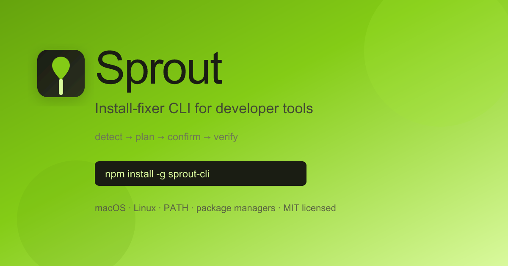

# 🌱 Sprout

[](https://github.com/murderszn/sprout/actions/workflows/ci.yml)
[](LICENSE)
[](package.json)
[](https://murderszn.github.io/sprout/)
[](https://discord.gg/h9aXFuKqsv)

**Install-fixer CLI for developer tools** — macOS & Linux

Sprout diagnoses and fixes local install/config/PATH problems for developer tools. You tell it what you want installed (or paste a broken install attempt); it detects what *this* machine actually has, proposes a plain-English plan, runs it step by step with your confirmation, and proves the result with a real verification command — instead of assuming a generic script works everywhere.

It is deliberately **not** a general coding agent. Its entire world is package managers, PATH, and shell rc files. It won't write your code, review your PRs, or answer unrelated questions — and it orchestrates existing package managers (brew, apt, dnf, npm, pip, …) rather than reimplementing them.

**v1 is Unix-first**: macOS and Linux. Windows (PowerShell, winget/choco/scoop) is a planned fast-follow; the types already leave room for it.

<p align="center">
  <a href="https://murderszn.github.io/sprout/">
    
  </a>
</p>

<p align="center">
  <a href="https://murderszn.github.io/sprout/#install"><strong>Get started</strong></a> ·
  <a href="https://github.com/murderszn/sprout/blob/main/COMMUNITY.md">Community</a> ·
  <a href="https://github.com/murderszn/sprout/blob/main/CONTRIBUTING.md">Contributing</a> ·
  <a href="https://github.com/murderszn/sprout/issues">Issues</a>
</p>

---

## Install

```sh
npm install -g sprout-install    # or run without installing: npx sprout-install install gh
```

From a checkout:

```sh
npm install && npm run build && npm link
```

## Setup — Pollinations (BYOP or bring your own key)

Inference goes to [Pollinations](https://gen.pollinations.ai) via its OpenAI-compatible API. Sprout never proxies or phones home with your key — it stays in your env or `~/.sprout/config.json` (chmod 600).

### Recommended: `sprout login` (Bring Your Own Pollen)

Authorize Sprout to spend **your** Pollen balance via Pollinations [BYOP](https://github.com/pollinations/pollinations/blob/main/BRING_YOUR_OWN_POLLEN.md):

```sh
sprout login
```

Opens **enter.pollinations.ai**, you approve access in the browser, and Sprout stores a scoped `sk_...` key locally. On first run of any command, Sprout offers this flow before asking you to paste a key.

### Alternative: paste your own `sk_...` key

1. Get a secret key at **https://enter.pollinations.ai**.
2. Run `sprout config --set-key`, or export `SPROUT_API_KEY`.

Key resolution order: `SPROUT_API_KEY` env var → `~/.sprout/config.json` → `sprout login` / interactive prompt. Keys are only ever shown masked (`sk_a****xyz`).

Default model: `gpt-5.4-mini` (override per-run with `--model`, or persistently with `sprout config --model <id>`).

## Usage

```sh
sprout install gh              # main flow: detect → plan → confirm each step → verify
sprout install ripgrep
sprout --dry-run install node  # exact command list, zero side effects
sprout --yes install jq        # skip per-step [y/N] prompts (hard guardrails still block)

sprout diagnose < broken.log   # pipe a failed install attempt, get a diagnosis + fix plan
brew install foo 2>&1 | sprout diagnose --tool foo
sprout diagnose                # interactive: paste the log, end with Ctrl-D

sprout login                   # authorize with Pollen (BYOP device flow)
sprout config                  # show masked key + model + config path
sprout config --set-key        # store a pasted sk_ key (input hidden)
sprout config --clear-key
sprout config --model gpt-5.4

sprout status                  # confirm the key works and the model is awake
sprout env                     # print the environment snapshot the agent sees
```

Seeded knowledge base (curated per-OS install + verify recipes): git, node (nvm), python (pyenv), docker, GitHub CLI, AWS CLI, kubectl, Homebrew, jq, ripgrep, terraform. Anything else works too — the model reasons it out live and **tells you** it's doing so rather than pretending it came from the curated data.

## How a run works

1. **Detect** — OS/version, shell + rc file, architecture, which package managers exist, PATH entries. One typed snapshot; everything downstream uses it.
2. **Plan** — the model states a short plain-English plan *before* any tool call.
3. **Confirm/execute** — each step shows the exact command (an argv array, executed with no shell) and the model's reason. Anything touching sudo, a system package manager, or an rc file asks `[y/N]` — default No. Results feed back to the model so it adapts to reality ("already installed", "permission denied") instead of replaying a script.
4. **Verify** — after the plan, Sprout runs the tool's verify command itself and shows the real output. "Done" means the verify passed, not that the model said so.

## Safety

- **No `curl | bash`, ever.** Remote scripts are downloaded to a file, shown to you, and only run after you confirm the script itself.
- **Hard-blocked patterns** — recursive deletes outside temp space, disk formatting, raw device writes, `/etc/passwd`-class files, fork bombs, power control — are refused before a confirmation prompt is even shown, and `--yes` does not override them.
- **sudo is exceptional**: only when a step genuinely requires it, with the reason surfaced before the prompt.
- **rc-file edits** always show the new content, always confirm (even under `--yes`), and back up the previous version next to the file.
- `--dry-run` produces the exact command list with zero side effects.
- Commands run as argv arrays via execa — no string interpolation, no shell expansion.

## Community

Questions, broken install logs, and knowledge-base ideas belong in [Discord](https://discord.gg/h9aXFuKqsv) (invite link in [COMMUNITY.md](COMMUNITY.md)) or [GitHub Issues](https://github.com/murderszn/sprout/issues).

- [COMMUNITY.md](COMMUNITY.md) — Discord setup, channels, branding assets
- [CONTRIBUTING.md](CONTRIBUTING.md) — add install recipes
- [CODE_OF_CONDUCT.md](CODE_OF_CONDUCT.md)
- [SECURITY.md](SECURITY.md)

## Development

```sh
npm run dev -- install jq      # run from source (tsx)
npm test                       # node:test suite (guardrails, knowledge base, agent loop with a scripted fake model)
npm run build
```

Copy `env.example` to `.env` for local development; `dotenv` picks it up.

To add a tool to the knowledge base, see [CONTRIBUTING.md](CONTRIBUTING.md).

---

<p align="center">
  <sub>Built by <a href="https://github.com/murderszn">murderszn</a> · MIT · Powered by <a href="https://enter.pollinations.ai">Pollinations</a></sub>
</p>